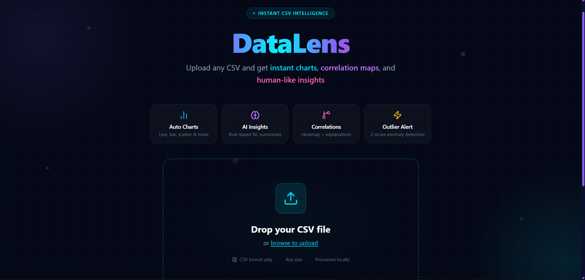
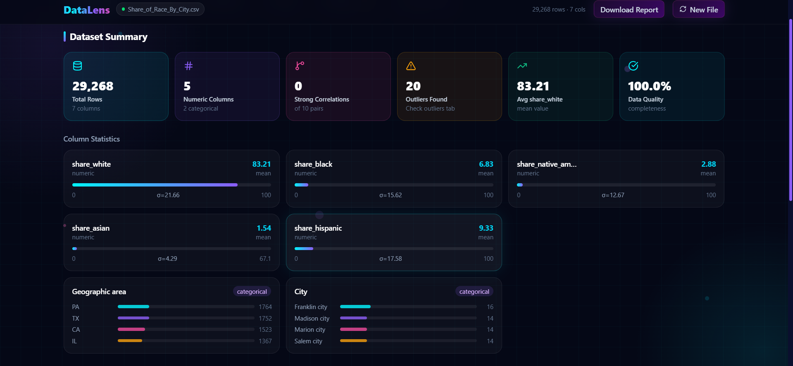
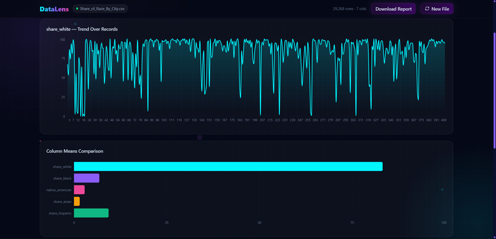
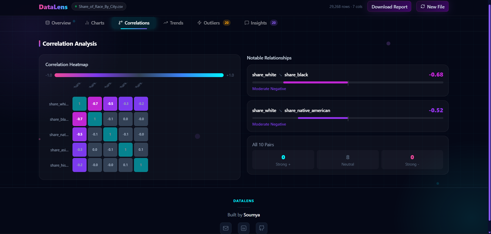

# DataLens

<p align="center">
  
</p>

<p align="center">
  <strong>Instant CSV Intelligence</strong>
</p>

<p align="center">
  Upload any CSV and instantly generate interactive dashboards, statistical insights, correlation analysis, anomaly detection, and professional PDF reports.
</p>

---

## Live Demo

https://datalens-csv-analyser.vercel.app/

---

## Features

### Automated Dataset Profiling
- Automatic CSV parsing
- Numeric and categorical column detection
- Dataset quality assessment
- Missing value analysis
- Statistical summaries

### Interactive Visualizations
- Trend charts
- Distribution analysis
- Mean comparison charts
- Dynamic dataset exploration

### Correlation Discovery
- Correlation matrix generation
- Interactive heatmaps
- Relationship strength detection
- Correlation insights

### Outlier Detection
- Z-score based anomaly detection
- Automatic outlier reporting
- Statistical anomaly explanations

### Insights Engine
- Rule-based natural language insights
- Trend observations
- Pattern discovery
- Dataset summaries

### Professional PDF Reports

Generate export-ready reports containing:

- Executive summary
- Dataset profile
- Statistical metrics
- Charts and visualizations
- Correlation analysis
- Outlier findings
- Insight summaries

---

# Screenshots

## Upload Interface

Upload any CSV file and instantly start exploring your data.


---

## Dataset Overview

Comprehensive dataset profiling with quality metrics, column statistics, and summary cards.



---

## Trend Analysis

Interactive trend visualizations and mean comparisons for numerical features.



---

## Correlation Analysis

Correlation heatmaps and relationship discovery between variables.



---

## Tech Stack

### Frontend
- React
- TypeScript
- Vite

### Data Processing
- PapaParse
- Custom Analytics Engine

### Charts and Visualization
- Recharts

### PDF Generation
- @react-pdf/renderer

### Styling
- CSS3
- Glassmorphism UI
- Responsive Design

---

## Project Structure

```text
src/
├── components/
│   ├── Dashboard.tsx
│   ├── SummaryCards.tsx
│   ├── TrendsPanel.tsx
│   ├── CorrelationHeatmap.tsx
│   ├── OutliersPanel.tsx
│   └── InsightsPanel.tsx
│
├── report/
│   └── pdf/
│       ├── ReportDocument.tsx
│       └── PDFCharts.tsx
│
├── utils/
│   └── analytics.ts
│
└── types/
```

## Getting Started

### Clone Repository

```bash
git clone https://github.com/soumyasengupta2005-rgb/DataLens.git
cd DataLens
```

### Install Dependencies

```bash
npm install
```

### Start Development Server

```bash
npm run dev
```

### Production Build

```bash
npm run build
```

---

## Example Use Cases

- Exploratory Data Analysis (EDA)
- Business Intelligence
- Academic Research
- Survey Analysis
- Financial Data Exploration
- Sports Analytics
- Government and Open Data Analysis

---

## Roadmap

### Planned Features

- AI-powered insights
- Natural language dataset querying
- Advanced forecasting
- Additional visualization types
- Dataset comparison mode
- Report customization
- Cloud report storage

---

## Performance

- Client-side CSV processing
- No backend required
- Instant analysis
- PDF report generation
- Responsive dashboard

---

## Author

**Soumya Sengupta**

GitHub:  
https://github.com/soumyasengupta2005-rgb

Portfolio:  
(https://soumyasengupta2005-rgb.github.io/portfolio/)

LinkedIn:  
(https://www.linkedin.com/in/soumya-sengupta-a8346633a)

---

## License

MIT License
